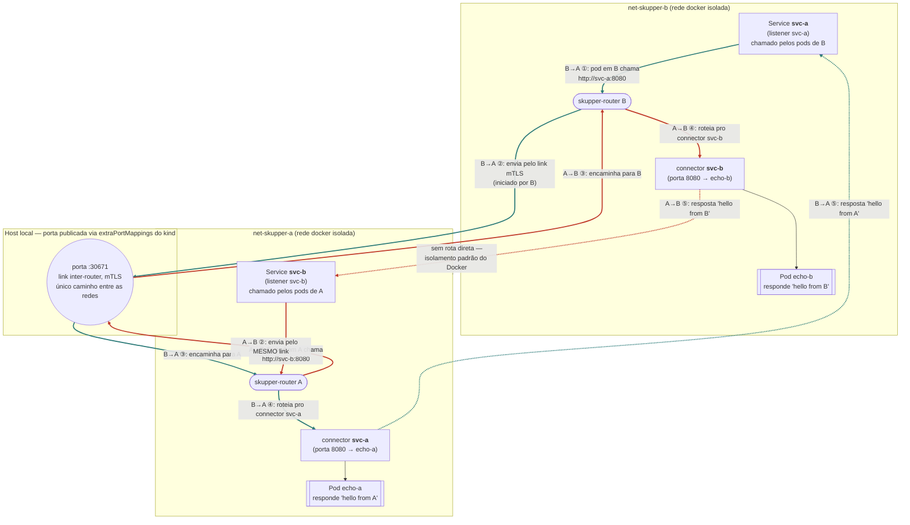

# PoC: conectar 2 clusters via Skupper

Link unidirecional entre dois clusters Kubernetes locais (kind), com acesso
bidirecional a serviços de aplicação sobre esse único link. Ver `PLAN.md`
para o roteiro completo de decisões e riscos considerados.

## Requisitos que a PoC prova

1. **Dois clusters Kubernetes distintos**, provisionados localmente com `kind`.
2. **Cada cluster expõe um Service consumido pelo outro** — acesso a serviço
   é bidirecional (A chama serviço de B, B chama serviço de A).
3. **Só um dos clusters fica exposto/alcançável pela rede** — a ligação é
   unidirecional (B disca para A; A nunca disca para fora), mesmo que o
   tráfego de aplicação depois flua nos dois sentidos sobre essa única
   ligação.
4. **Conexão segura** — mTLS, validado explicitamente (não é só assumido).
5. **Simulação de "clusters conectados via internet"**, não apenas na mesma
   rede local — **sem tocar na configuração de rede da máquina local** (nada
   de `sudo`, nada de `iptables`/firewall manual no host).

## Arquitetura de rede

O diagrama abaixo mostra o caminho **completo e nomeado** de uma chamada em
cada sentido — de qual `Service` cada lado chama até qual Pod responde,
passando pela única porta publicada no host. As cores marcam os dois
sentidos independentes: <span style="color:#2b7a78">**verde-azulado = B chamando `svc-a` (responde `echo-a`, em A)**</span>
e <span style="color:#c0392b">**vermelho = A chamando `svc-b` (responde `echo-b`, em B)**</span>;
as linhas pontilhadas na mesma cor são a resposta voltando.



Note o essencial: **um único link TCP/TLS** (a linha cinza pontilhada mostra
que não existe nenhuma outra rota entre `net-skupper-a` e `net-skupper-b` —
a única forma de atravessar é pela porta `:30671` publicada no host) é
usado nos **dois sentidos**. Ele é iniciado por B (`skupper token redeem`,
ver `PLAN.md`), mas depois de estabelecido carrega tanto o tráfego
"B → svc-a → echo-a" quanto "A → svc-b → echo-b" — daí ligação
**unidirecional** (só B disca) com acesso a serviço **bidirecional**. Os
nomes `svc-a`/`svc-b` são as *routing keys* do Skupper: cada lado roda um
`connector` (junto do Pod real) e um `listener` (que cria o `Service` local
consumido pelos próprios pods do cluster) para a routing key do outro lado.

Cada cluster kind roda na sua própria rede docker isolada
(`net-skupper-a`, `net-skupper-b`) em vez de compartilhar a rede `kind`
default — isso evita que os dois clusters se enxerguem como se estivessem na
mesma LAN. O único caminho de A para B (na verdade, de B para A) é a porta
publicada no host via `extraPortMappings` do kind, o mesmo mecanismo que já
publica a porta da API do Kubernetes — nenhuma regra de firewall extra. (Há
também uma segunda porta publicada, `:30672`, usada só no bootstrap do
`token issue`/`redeem` — omitida aqui para não distrair do fluxo de
tráfego; ver `docs/ARCHITECTURE.md`.)

Este é só o diagrama de topologia com o fluxo de tráfego. Para a
arquitetura completa — componentes por namespace, sequência de bootstrap
do link (grant/token/redeem), a mesma troca de tráfego em formato de
sequência, cadeia de mTLS, defesa em profundidade da unidirecionalidade
(NetworkPolicy/Calico) e os cenários de falha simulados — ver
**[`docs/ARCHITECTURE.md`](docs/ARCHITECTURE.md)**, com um diagrama
Mermaid para cada um desses tópicos.

Detalhes completos das decisões (por que Calico só em A, por que
`extraPortMappings` em vez de MetalLB, o que o token precisa ter reescrito
antes do `redeem`, etc.) estão em `PLAN.md`.

## Pré-requisitos

- `docker`, `kind` (>= 0.31), `kubectl`, `helm`, `skupper` CLI (v2.1.1) e
  `jq` no PATH.
- Nenhum root/sudo necessário.
- Não precisa conferir isso manualmente: `make preflight` (e todo alvo do
  Makefile, automaticamente) já valida que essas ferramentas estão
  instaladas antes de fazer qualquer outra coisa — ver seção seguinte.

## Ordem de execução

```sh
make preflight              # só confere as ferramentas de host (docker, kind,
                             # kubectl, helm, skupper, jq) - roda sozinho ou
                             # automaticamente antes de qualquer outro alvo
make up                    # scripts 00->09: clusters no ar, link connected,
                            # curl bidirecional passando
make validate               # revalidação não-destrutiva (e2e + tls + unidirectional)
make test-tls                # só a validação de mTLS
make test-unidirectional      # só a validação de NetworkPolicy/unidirecionalidade
make metrics                  # gera metrics/results-<timestamp>.csv (link ainda ativo)
make test-network-drop         # reconexão automática após queda de rede simulada
make test-revocation             # DESTRUTIVO: revoga o link, termina a PoC funcional
make relink                        # reestabelece o link após test-revocation, sem recriar nada
make down                            # remove os 2 clusters e as 2 redes docker
```

`make up` sozinho já prova o requisito central. Os demais targets são
validações adicionais e independentes. `test-network-drop` roda antes de
`test-revocation` de propósito: o primeiro termina com o link ativo de novo,
o segundo é destrutivo.

Todo alvo do Makefile depende de `preflight` (`scripts/check-tools.sh`):
antes de tocar em qualquer cluster/rede, ele confere se `docker`, `kind`,
`kubectl`, `helm`, `skupper` e `jq` estão no PATH. Se faltar alguma, o
Makefile para imediatamente e imprime **todas** as ferramentas ausentes de
uma vez (não só a primeira), cada uma com um link/comando de instalação
sugerido — não é preciso rodar `make` repetidas vezes só para descobrir a
próxima dependência faltando.

## Cleanup

`make down` remove os releases Helm, os 2 clusters kind e as 2 redes docker
(`net-skupper-a`, `net-skupper-b`). Idempotente — pode ser rodado mesmo se um
passo anterior falhou no meio do caminho.

## Estrutura

```
kind/            configs dos clusters (podSubnet, extraPortMappings, CNI)
networkpolicy/   NetworkPolicy de egress-deny (defesa em profundidade em A)
workload/        Deployments dos serviços de eco (echo-a, echo-b)
scripts/         um script por passo, numerado na ordem de execução
metrics/         CSVs gerados por make metrics
docs/            ARCHITECTURE.md (diagramas Mermaid) + mapeamento Skupper v1 -> v2
```
