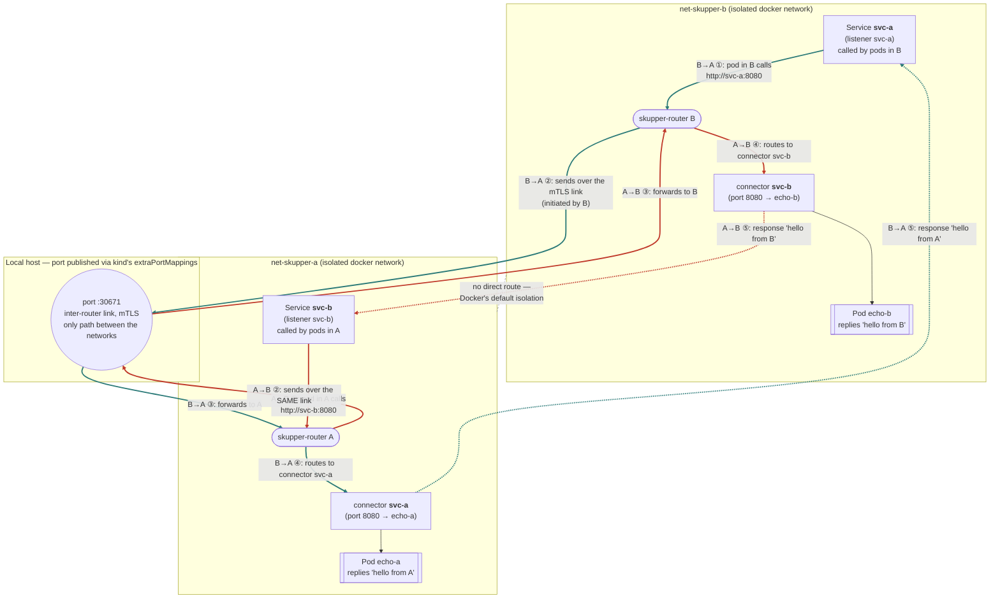

# PoC: connecting 2 clusters via Skupper

*Languages: English (this file) · [Português (pt-BR)](README.pt-BR.md).*

A one-way link between two local Kubernetes clusters (kind), with
two-way access to application services over that single link. See
`PLAN.md` (in Portuguese) for the full roadmap of decisions and risks
considered.

## Requirements this PoC proves

1. **Two distinct Kubernetes clusters**, provisioned locally with `kind`.
2. **Each cluster exposes a Service consumed by the other** — service
   access is bidirectional (A calls B's service, B calls A's service).
3. **Only one of the clusters is exposed/reachable over the network** —
   the connection is unidirectional (B dials A; A never dials out), even
   though application traffic then flows both ways over that single
   connection.
4. **Secure connection** — mTLS, explicitly validated (not just assumed).
5. **Simulation of "clusters connected over the internet"**, not just on
   the same local network — **without touching the local machine's
   network configuration** (no `sudo`, no manual `iptables`/firewall rule
   on the host).

## Network architecture

The diagram below shows the **full, named** path of a call in each
direction — which `Service` each side calls, all the way to which Pod
answers, through the single port published on the host. The colors mark
the two independent directions: <span style="color:#2b7a78">**teal = B calling `svc-a` (answered by `echo-a`, in A)**</span>
and <span style="color:#c0392b">**red = A calling `svc-b` (answered by `echo-b`, in B)**</span>;
the dotted lines in the same color are the response coming back.



Note the essential part: **a single TCP/TLS link** (the dotted gray line
shows that there is no other route between `net-skupper-a` and
`net-skupper-b` — the only way across is through the `:30671` port
published on the host) is used in **both directions**. It's initiated by
B (`skupper token redeem`, see `PLAN.md`), but once established it
carries both "B → svc-a → echo-a" traffic and "A → svc-b → echo-b"
traffic — hence a **unidirectional** connection (only B dials) with
**bidirectional** service access. The names `svc-a`/`svc-b` are Skupper
*routing keys*: each side runs a `connector` (next to the real Pod) and a
`listener` (which creates the local `Service` consumed by the cluster's
own pods) for the other side's routing key.

Each kind cluster runs on its own isolated docker network
(`net-skupper-a`, `net-skupper-b`) instead of sharing the default `kind`
network — this keeps the two clusters from seeing each other as if they
were on the same LAN. The only path from A to B (really, from B to A) is
the port published on the host via kind's `extraPortMappings`, the same
mechanism that already publishes the Kubernetes API port — no extra
firewall rule. (There's also a second published port, `:30672`, used only
for `token issue`/`redeem` bootstrap — omitted here so it doesn't
distract from the traffic flow; see `docs/ARCHITECTURE.md`.)

This is just the topology diagram with the traffic flow. For the full
architecture — components per namespace, the link's bootstrap sequence
(grant/token/redeem), the same traffic exchange as a sequence diagram,
the mTLS chain, defense-in-depth for the unidirectionality
(NetworkPolicy/Calico), and the simulated failure scenarios — see
**[`docs/ARCHITECTURE.md`](docs/ARCHITECTURE.md)** (or the Portuguese
version, [`docs/ARCHITECTURE.pt-BR.md`](docs/ARCHITECTURE.pt-BR.md)),
with a Mermaid diagram for each of those topics.

Full details on the decisions (why Calico only on A, why
`extraPortMappings` instead of MetalLB, what field in the token needs
rewriting before `redeem`, etc.) are in `PLAN.md` (in Portuguese).

## Prerequisites

- `docker`, `kind` (>= 0.31), `kubectl`, `helm`, `skupper` CLI (v2.1.1),
  and `jq` on the PATH.
- No root/sudo required.
- No need to check this by hand: `make preflight` (and every Makefile
  target, automatically) already validates that these tools are
  installed before doing anything else — see the next section.

## Execution order

```sh
make preflight              # only checks host tools (docker, kind,
                             # kubectl, helm, skupper, jq) - runs standalone
                             # or automatically before any other target
make up                    # scripts 00->09: clusters up, link connected,
                            # bidirectional curl passing
make validate               # non-destructive revalidation (e2e + tls + unidirectional)
make test-tls                # only the mTLS validation
make test-unidirectional      # only the NetworkPolicy/unidirectionality validation
make metrics                  # generates metrics/results-<timestamp>.csv (link still up)
make test-network-drop         # automatic reconnection after a simulated network drop
make test-revocation             # DESTRUCTIVE: revokes the link, ends the working PoC
make relink                        # re-establishes the link after test-revocation, no recreation
make down                            # removes both clusters and both docker networks
```

`make up` alone already proves the central requirement. The other
targets are additional, independent validations. `test-network-drop`
runs before `test-revocation` on purpose: the first ends with the link
active again, the second is destructive.

Every Makefile target depends on `preflight`
(`scripts/check-tools.sh`): before touching any cluster/network, it
checks whether `docker`, `kind`, `kubectl`, `helm`, `skupper`, and `jq`
are on the PATH. If any are missing, the Makefile stops immediately and
prints **every** missing tool at once (not just the first one), each
with a suggested install link/command — no need to run `make` repeatedly
just to discover the next missing dependency.

## Cleanup

`make down` removes the Helm releases, both kind clusters, and both
docker networks (`net-skupper-a`, `net-skupper-b`). Idempotent — safe to
run even if a previous step failed partway through.

## Repository layout

```
kind/            cluster configs (podSubnet, extraPortMappings, CNI)
networkpolicy/   egress-deny NetworkPolicy (defense in depth in A)
workload/        echo service Deployments (echo-a, echo-b)
scripts/         one script per step, numbered in execution order
metrics/         CSVs generated by make metrics
docs/            ARCHITECTURE.md / ARCHITECTURE.pt-BR.md (Mermaid diagrams)
                 + Skupper v1 -> v2 mapping
```
