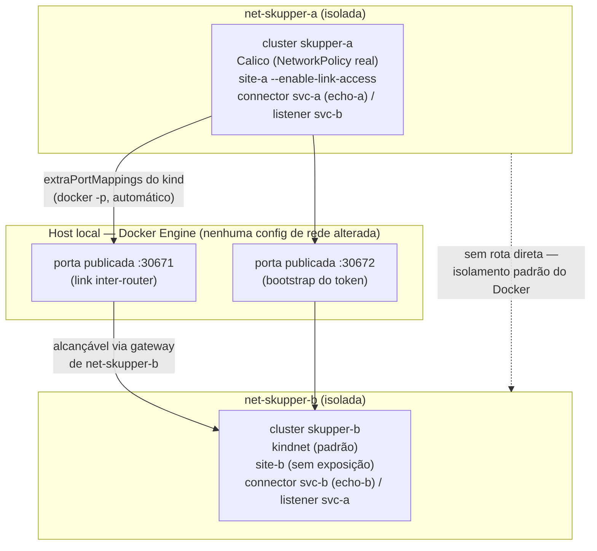

# PoC: conectar 2 clusters via Skupper

Link unidirecional entre dois clusters Kubernetes locais (kind), com acesso
bidirecional a serviços de aplicação sobre esse único link. Ver `PLAN.md`
para o roteiro completo de decisões e riscos considerados.

## Requisitos que a PoC prova

1. **Dois clusters Kubernetes distintos**, provisionados localmente com `kind`.
2. **Cada cluster expõe um Service consumido pelo outro** — acesso a serviço
   é bidirecional (A chama serviço de B, B chama serviço de A).
3. **Só um dos clusters fica exposto/alcançável pela rede** — a ligação é
   unidirecional (B disca para A; A nunca disca para fora), mesmo que o
   tráfego de aplicação depois flua nos dois sentidos sobre essa única
   ligação.
4. **Conexão segura** — mTLS, validado explicitamente (não é só assumido).
5. **Simulação de "clusters conectados via internet"**, não apenas na mesma
   rede local — **sem tocar na configuração de rede da máquina local** (nada
   de `sudo`, nada de `iptables`/firewall manual no host).

## Arquitetura de rede



Cada cluster kind roda na sua própria rede docker isolada
(`net-skupper-a`, `net-skupper-b`) em vez de compartilhar a rede `kind`
default — isso evita que os dois clusters se enxerguem como se estivessem na
mesma LAN. O único caminho de A para B (na verdade, de B para A) é a porta
publicada no host via `extraPortMappings` do kind, o mesmo mecanismo que já
publica a porta da API do Kubernetes — nenhuma regra de firewall extra.

Este é só o diagrama de topologia. Para a arquitetura completa — componentes
por namespace, sequência de bootstrap do link (grant/token/redeem), fluxo de
tráfego bidirecional sobre o link único, cadeia de mTLS, defesa em
profundidade da unidirecionalidade (NetworkPolicy/Calico) e os cenários de
falha simulados — ver **[`docs/ARCHITECTURE.md`](docs/ARCHITECTURE.md)**,
com um diagrama Mermaid para cada um desses tópicos.

Detalhes completos das decisões (por que Calico só em A, por que
`extraPortMappings` em vez de MetalLB, o que o token precisa ter reescrito
antes do `redeem`, etc.) estão em `PLAN.md`.

## Pré-requisitos

- `docker`, `kind` (>= 0.31), `kubectl`, `helm`, `skupper` CLI (v2.1.1) e
  `jq`/`yq` no PATH.
- Nenhum root/sudo necessário.

## Ordem de execução

```sh
make up                    # scripts 00->09: clusters no ar, link connected,
                            # curl bidirecional passando
make validate               # revalidação não-destrutiva (e2e + tls + unidirectional)
make test-tls                # só a validação de mTLS
make test-unidirectional      # só a validação de NetworkPolicy/unidirecionalidade
make metrics                  # gera metrics/results-<timestamp>.csv (link ainda ativo)
make test-network-drop         # reconexão automática após queda de rede simulada
make test-revocation             # DESTRUTIVO: revoga o link, termina a PoC funcional
make relink                        # reestabelece o link após test-revocation, sem recriar nada
make down                            # remove os 2 clusters e as 2 redes docker
```

`make up` sozinho já prova o requisito central. Os demais targets são
validações adicionais e independentes. `test-network-drop` roda antes de
`test-revocation` de propósito: o primeiro termina com o link ativo de novo,
o segundo é destrutivo.

## Cleanup

`make down` remove os releases Helm, os 2 clusters kind e as 2 redes docker
(`net-skupper-a`, `net-skupper-b`). Idempotente — pode ser rodado mesmo se um
passo anterior falhou no meio do caminho.

## Estrutura

```
kind/            configs dos clusters (podSubnet, extraPortMappings, CNI)
networkpolicy/   NetworkPolicy de egress-deny (defesa em profundidade em A)
workload/        Deployments dos serviços de eco (echo-a, echo-b)
scripts/         um script por passo, numerado na ordem de execução
metrics/         CSVs gerados por make metrics
docs/            ARCHITECTURE.md (diagramas Mermaid) + mapeamento Skupper v1 -> v2
```
