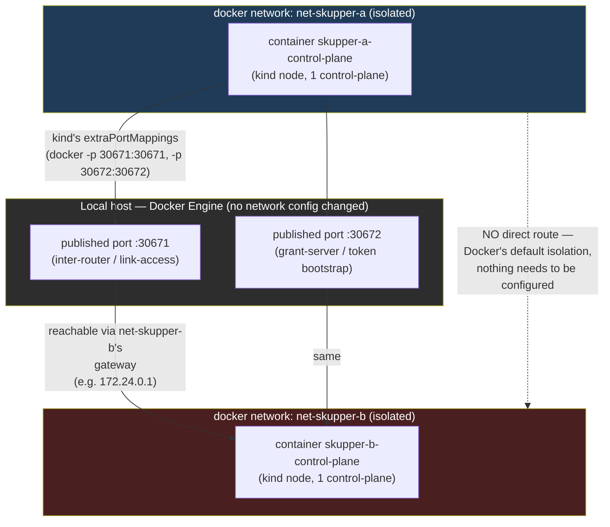
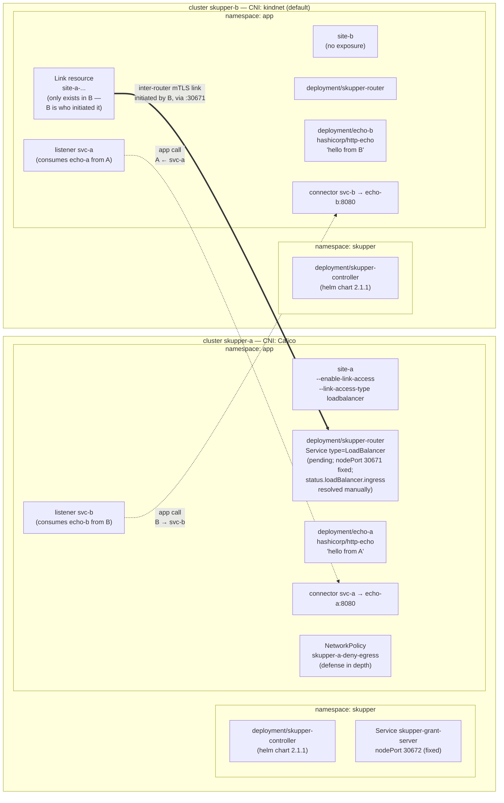
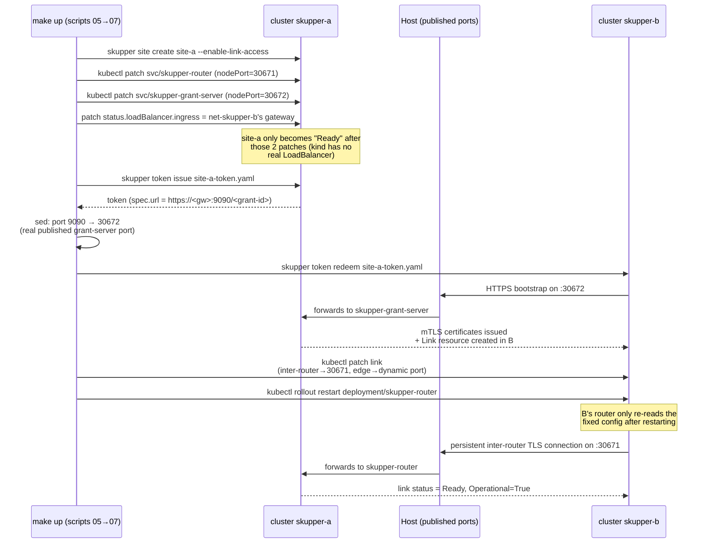
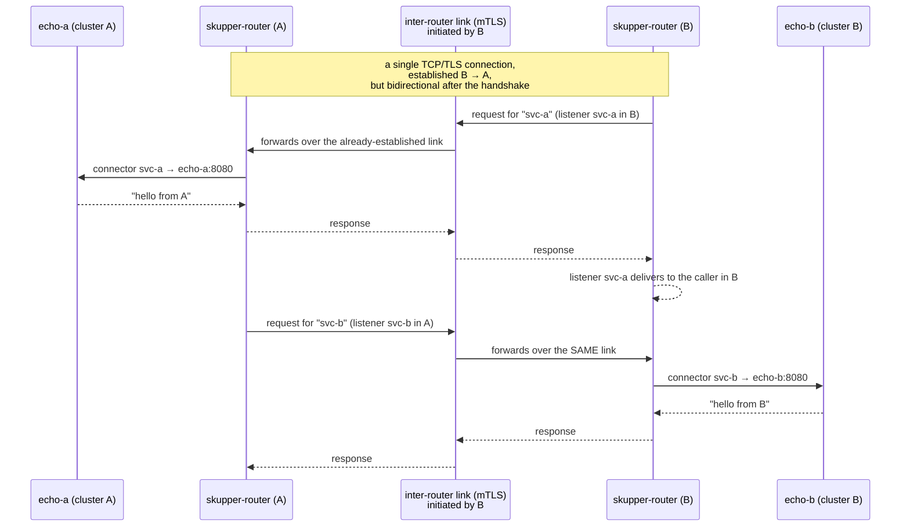
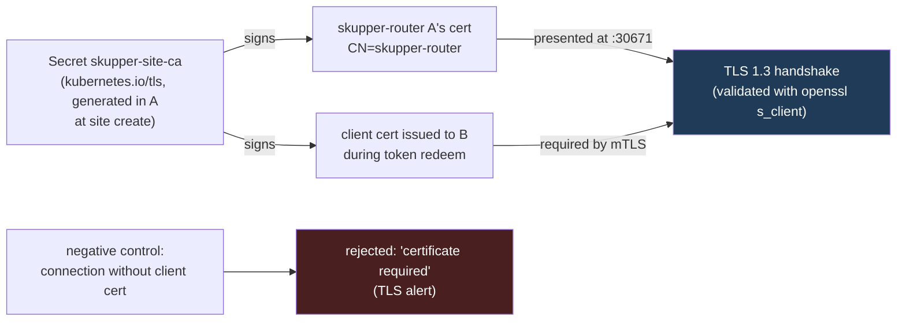
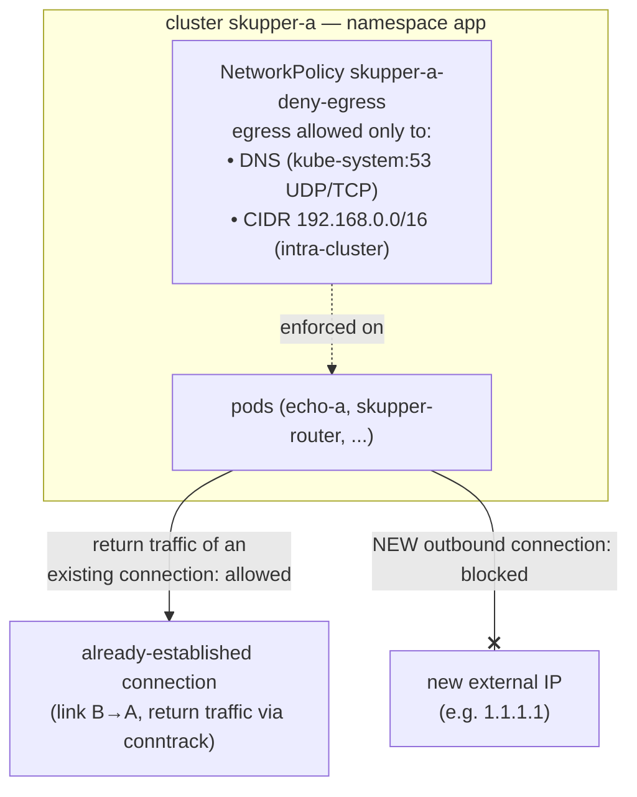
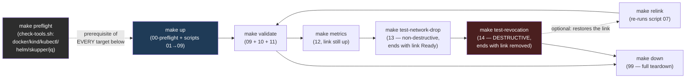

# Detailed PoC architecture

*Languages: English (this file) · [Português (pt-BR)](ARCHITECTURE.pt-BR.md).*

This document details, with Mermaid diagrams, how the PoC described in
`README.md` and `PLAN.md` (in Portuguese) is put together: network
topology, components per cluster, the link's bootstrap sequence,
application traffic flow, the mTLS chain, and defense-in-depth for the
unidirectionality. For the reasoning behind each decision (why Calico
only on A, why `extraPortMappings` instead of MetalLB, etc.), see
`PLAN.md`.

## 1. Overview

| Item | Cluster A (`skupper-a`) | Cluster B (`skupper-b`) |
|---|---|---|
| Docker network | `net-skupper-a` (isolated) | `net-skupper-b` (isolated) |
| CNI | Calico (enforces `NetworkPolicy`) | kindnet (kind's default) |
| Pod CIDR | `192.168.0.0/16` | kind's default |
| Exposure | `site-a --enable-link-access` (only reachable side) | none |
| Role in the link | receives (never dials out) | initiates (`token redeem`) |
| Local workload | `echo-a` → replies `hello from A` | `echo-b` → replies `hello from B` |
| Exposes to the other | `connector svc-a` (echo-a) | `connector svc-b` (echo-b) |
| Consumes from the other | `listener svc-b` | `listener svc-a` |
| `Link` resource | doesn't exist (A never "knows" how to dial) | exists (B is who redeemed the token) |

Two of A's ports are published on the host via kind's
`extraPortMappings` (a standard kind/Docker mechanism, equivalent to
what already publishes the Kubernetes API port — no manual firewall
rule):

| Host port | Use | Service / namespace in A |
|---|---|---|
| `30671` | inter-router link (link traffic, mTLS) | `app/skupper-router` (fixed nodePort) |
| `30672` | token bootstrap (`grant-server`) | `skupper/skupper-grant-server` (fixed nodePort) |

## 2. Network topology — simulating "over the internet" without touching the host

The core idea: `net-skupper-a` and `net-skupper-b` are different Docker
networks and are **never connected to each other**. Docker already
isolates different networks by default. The only path between them is
indirect, via the host: kind publishes A's ports on the host (`-p
hostPort:containerPort`, generated from `extraPortMappings`), and any
container on `net-skupper-b` already sees the host through **that
network's own gateway** (`net-skupper-b` has, by Docker's default, a
host interface acting as gateway — the same address containers on that
network use to reach the real internet). This simulates a "public IP"
for A quite well: B only knows that gateway + published port, never
site A's real internal IP.

Key points:

- **A never dials out.** The only inbound path into A is the port
  published on the host. Outside of it, `net-skupper-a` stays isolated.
- **B only knows A's "public address"** (gateway + published port),
  never `net-skupper-a`'s real internal network — exactly what would
  happen if A were behind a NAT/router on the real internet.
- Once the TCP/TLS link is established (B → A), the resulting connection
  is **bidirectional**: A can expose `svc-a` to B and consume `svc-b`
  from B over that same connection, without ever needing its own
  outbound route.

## 3. Components inside each cluster

## 4. Link bootstrap sequence (grant → token → redeem)

## 5. Bidirectional application traffic over the single link

Different routing keys (`svc-a`, `svc-b`) avoid collisions, since both
sides have a **connector and a listener at the same time** — that's what
gives bidirectional service access over a unidirectional network
connection.

## 6. Connection security — mTLS

`scripts/10-validate-tls.sh` proves this two ways: (1) it inspects the
`kubernetes.io/tls` Secrets in A's `app` namespace (the site's own CA,
not plain text); (2) it performs a raw TLS handshake against
`<gateway>:30671`, confirms `Peer certificate: CN=skupper-router`, and
then confirms that the same connection **without** a client certificate
is rejected by mTLS (`tlsv1.3 alert certificate required`) — a negative
control that proves mutual authentication, not just one-sided
encryption.

## 7. Defense-in-depth for unidirectionality (NetworkPolicy + Calico)

Docker's network isolation already guarantees A has no outbound route of
its own (section 2). `networkpolicy/skupper-a-deny-egress.yaml` adds a
second layer, **inside** cluster A, enforced by Calico (the default CNI,
kindnet, doesn't enforce `NetworkPolicy` — which is why A needs Calico
and B doesn't):

`scripts/11-validate-unidirectional.sh` proves both halves: with the
policy applied, the **already-established** bidirectional traffic keeps
working (Calico's egress-deny only affects *new* connections; return
traffic of an existing connection keeps flowing via conntrack); and an
attempt at a **new** connection from inside A to `1.1.1.1` fails — a
negative control that proves the policy is real (Calico), not an inert
NetworkPolicy.

## 8. Makefile execution order

`test-network-drop` runs before `test-revocation` on purpose: the first
ends with the link active again (automatic reconnection after `docker
network disconnect`/`connect` on B's node); the second is destructive by
definition (`skupper link delete`) and therefore runs last. `make
relink` exists precisely to reconnect the clusters after
`test-revocation` without having to recreate anything.

Every Makefile target (`up`, `validate`, `test-tls`,
`test-unidirectional`, `metrics`, `test-network-drop`,
`test-revocation`, `relink`, `down`) declares `preflight` as a
prerequisite — `make` runs `scripts/check-tools.sh` before any other
command. That script scans `docker`, `kind`, `kubectl`, `helm`,
`skupper`, and `jq`, reports **every** missing tool at once (not just
the first one) with an install suggestion for each, and only lets the
requested target proceed if all of them are present. `00-preflight.sh`
(called only by `make up`) reuses that same `check-tools.sh` and then
also checks for the absence of cluster/network/port name collisions
before creating anything.

## 9. Simulated failure scenarios

| Scenario | Script | Mechanism | Expected result |
|---|---|---|---|
| B's network drop | `13-simulate-network-drop.sh` | `docker network disconnect/connect net-skupper-b skupper-b-control-plane` | Link goes back to `Operational=True` on its own; bidirectional traffic recovers (with a short retry) |
| Link revocation | `14-test-link-revocation.sh` | `skupper link delete <name>` (from B, who created it) | Traffic fails **in both directions** — proves there's no alternate path |

Both scenarios use only standard Docker/Skupper operations on the PoC's
own containers and resources — no change to the host's network.
