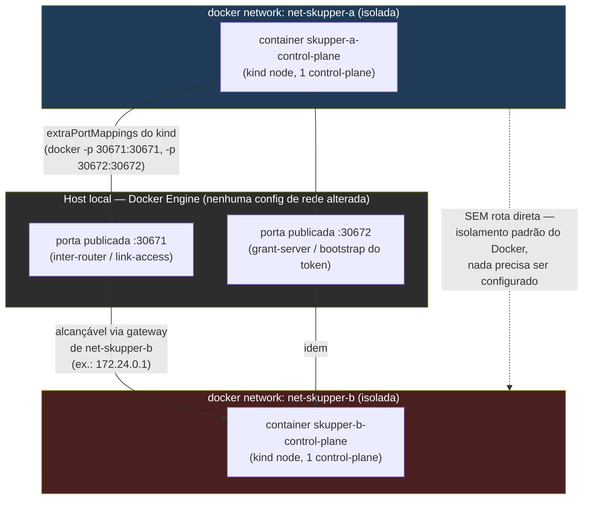
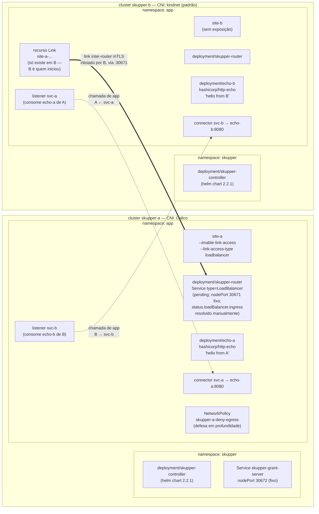
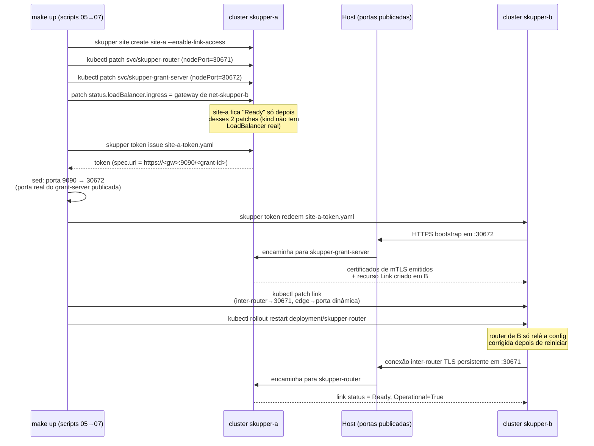
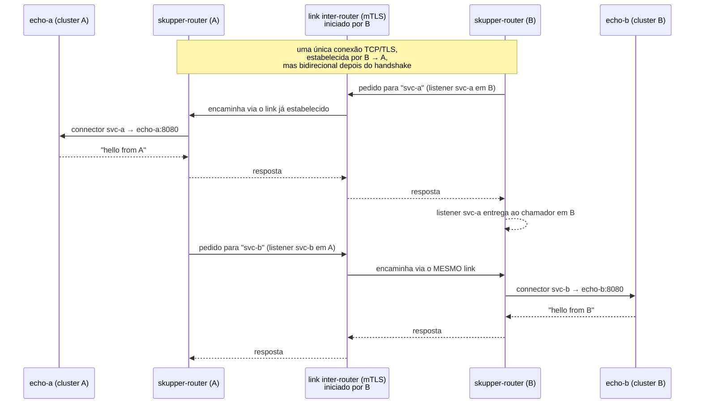
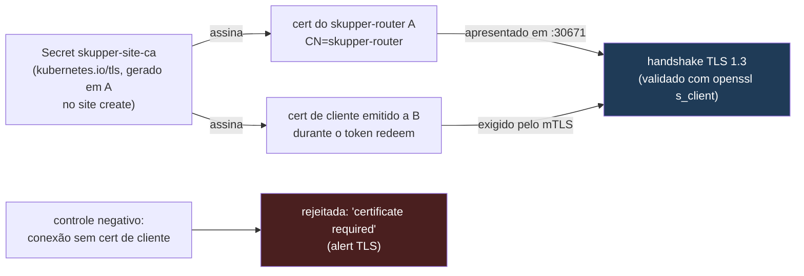
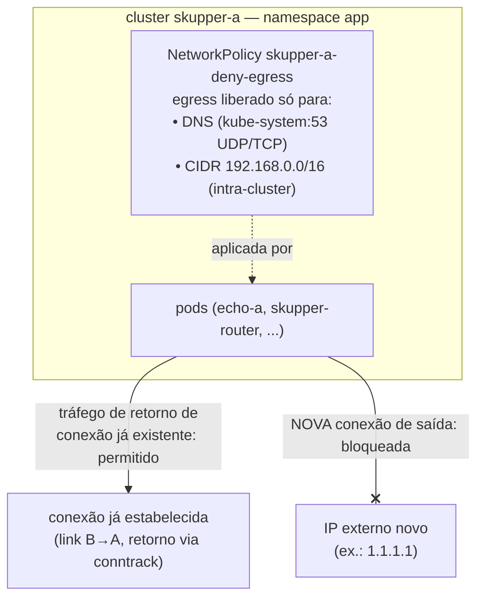
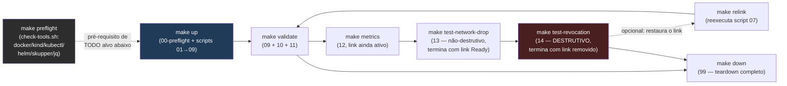

# Arquitetura detalhada da PoC

*Idiomas: [English](ARCHITECTURE.md) · Português (pt-BR) — este arquivo.*

Este documento detalha, com diagramas Mermaid, como a PoC descrita no
`README.pt-BR.md` e no `PLAN.md` é montada: topologia de rede, componentes
por cluster, sequência de bootstrap do link, fluxo de tráfego de
aplicação, cadeia de mTLS e defesa em profundidade da unidirecionalidade.
Para o raciocínio por trás de cada decisão (por que Calico só em A, por
que `extraPortMappings` em vez de MetalLB, etc.), ver `PLAN.md`.

## 1. Visão geral

| Item | Cluster A (`skupper-a`) | Cluster B (`skupper-b`) |
|---|---|---|
| Rede docker | `net-skupper-a` (isolada) | `net-skupper-b` (isolada) |
| CNI | Calico (aplica `NetworkPolicy`) | kindnet (padrão do kind) |
| Pod CIDR | `192.168.0.0/16` | padrão do kind |
| Exposição | `site-a --enable-link-access` (único lado alcançável) | nenhuma |
| Papel no link | recebe (nunca disca para fora) | inicia (`token redeem`) |
| Workload local | `echo-a` → responde `hello from A` | `echo-b` → responde `hello from B` |
| Expõe para o outro | `connector svc-a` (echo-a) | `connector svc-b` (echo-b) |
| Consome do outro | `listener svc-b` | `listener svc-a` |
| Recurso `Link` | não existe (A nunca "sabe" discar) | existe (B é quem resgatou o token) |

Duas portas de A são publicadas no host via `extraPortMappings` do kind
(mecanismo padrão do kind/Docker, equivalente ao que já publica a porta da
API do Kubernetes — nenhuma regra de firewall manual):

| Porta host | Uso | Service / namespace em A |
|---|---|---|
| `30671` | link inter-router (tráfego do link, mTLS) | `app/skupper-router` (nodePort fixo) |
| `30672` | bootstrap do token (`grant-server`) | `skupper/skupper-grant-server` (nodePort fixo) |

## 2. Topologia de rede — simulação "via internet" sem tocar no host

A ideia central: `net-skupper-a` e `net-skupper-b` são redes Docker
diferentes e **nunca são conectadas entre si**. O Docker já isola redes
diferentes por padrão. O único caminho entre elas é indireto, via o host:
o kind publica as portas de A no host (`-p hostPort:containerPort`, gerado
a partir de `extraPortMappings`), e qualquer container em `net-skupper-b`
já enxerga o host através do **gateway da própria rede** (`net-skupper-b`
tem, por padrão do Docker, uma interface do host atuando como gateway —
é o mesmo endereço que containers dessa rede usam para sair para a
internet real). Isso simula muito bem um "IP público" de A: B só conhece
esse gateway + porta publicada, nunca o IP interno real do site A.

Pontos-chave:

- **A nunca disca para fora.** O único caminho de entrada de A é a porta
  publicada no host. Fora dela, `net-skupper-a` continua isolada.
- **B só conhece o "endereço público" de A** (gateway + porta publicada),
  nunca a rede interna real de `net-skupper-a` — exatamente como aconteceria
  se A estivesse atrás de um NAT/roteador na internet real.
- Uma vez que o link TCP/TLS é estabelecido (B → A), a conexão resultante é
  **bidirecional**: A consegue expor `svc-a` para B e consumir `svc-b` de B
  pela mesma ligação, sem nunca precisar de rota de saída própria.

## 3. Componentes dentro de cada cluster

## 4. Sequência de bootstrap do link (grant → token → redeem)

## 5. Tráfego de aplicação bidirecional sobre o link único

Routing-keys diferentes (`svc-a`, `svc-b`) evitam colisão, já que os dois
lados têm **connector e listener ao mesmo tempo** — é isso que dá acesso
bidirecional a serviço sobre uma ligação de rede unidirecional.

## 6. Segurança da conexão — mTLS

`scripts/10-validate-tls.sh` prova isso de duas formas: (1) inspeciona os
Secrets `kubernetes.io/tls` no namespace `app` de A (CA própria do site,
não é texto plano); (2) faz um handshake TLS bruto contra
`<gateway>:30671`, confirma `Peer certificate: CN=skupper-router`, e depois
confirma que a mesma conexão **sem** certificado de cliente é rejeitada
pelo mTLS (`tlsv1.3 alert certificate required`) — controle negativo que
prova autenticação mútua, não só criptografia de um lado.

## 7. Unidirecionalidade em profundidade (NetworkPolicy + Calico)

O isolamento de rede Docker já garante que A não tem rota de saída própria
(seção 2). `networkpolicy/skupper-a-deny-egress.yaml` adiciona uma segunda
camada, **dentro** do cluster A, aplicada pelo Calico (o CNI padrão,
kindnet, não aplica `NetworkPolicy` — por isso A precisa de Calico e B não):

`scripts/11-validate-unidirectional.sh` prova as duas metades: com a
policy aplicada, o tráfego bidirecional **já estabelecido** continua
funcionando (egress-deny do Calico só afeta conexões *novas*, o retorno de
uma conexão existente segue via conntrack); e uma tentativa de **nova**
conexão de dentro de A para `1.1.1.1` falha — controle negativo que prova
que a policy é real (Calico), não um NetworkPolicy inerte.

## 8. Ordem de execução via Makefile

`test-network-drop` roda antes de `test-revocation` de propósito: o
primeiro termina com o link ativo de novo (reconexão automática após
`docker network disconnect`/`connect` no node de B); o segundo é
destrutivo por definição (`skupper link delete`) e por isso roda por
último. `make relink` existe justamente para religar os clusters depois de
`test-revocation` sem precisar recriar nada do zero.

Todo alvo do Makefile (`up`, `validate`, `test-tls`,
`test-unidirectional`, `metrics`, `test-network-drop`, `test-revocation`,
`relink`, `down`) declara `preflight` como pré-requisito — `make` roda
`scripts/check-tools.sh` antes de qualquer outro comando. Esse script
varre `docker`, `kind`, `kubectl`, `helm`, `skupper` e `jq`, reporta
**todas** as ferramentas ausentes de uma vez (não só a primeira) com uma
sugestão de instalação para cada uma, e só deixa o alvo pedido prosseguir
se todas estiverem presentes. `00-preflight.sh` (chamado só por `make up`)
reaproveita o mesmo `check-tools.sh` e, depois, confere também a ausência
de colisão de nomes de cluster/rede/porta antes de criar qualquer coisa.

## 9. Cenários de falha simulados

| Cenário | Script | Mecanismo | Resultado esperado |
|---|---|---|---|
| Queda de rede de B | `13-simulate-network-drop.sh` | `docker network disconnect/connect net-skupper-b skupper-b-control-plane` | Link volta a `Operational=True` sozinho; tráfego bidirecional se recupera (com retry curto) |
| Revogação do link | `14-test-link-revocation.sh` | `skupper link delete <nome>` (a partir de B, quem o criou) | Tráfego falha **nos dois sentidos** — prova que não há caminho alternativo |

Ambos os cenários usam só operações padrão do Docker/Skupper sobre
containers e recursos da própria PoC — nenhuma mudança na rede do host.
